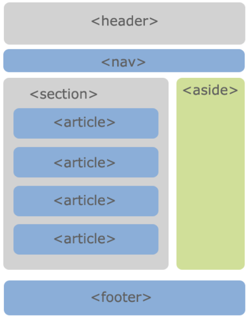
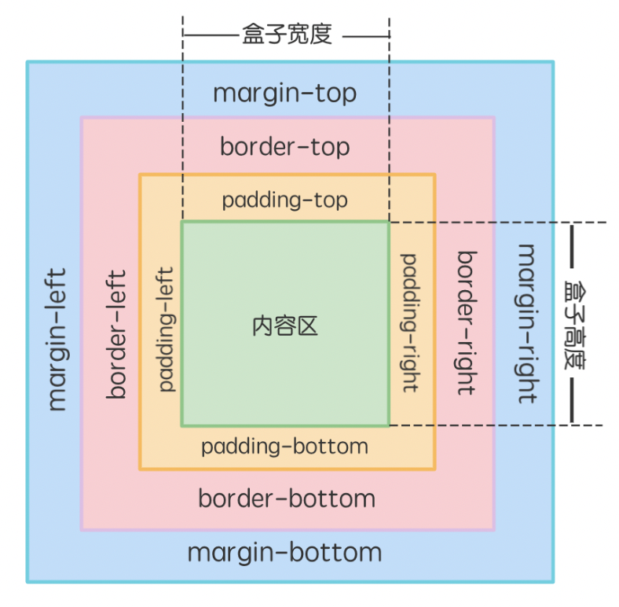
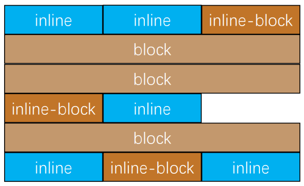
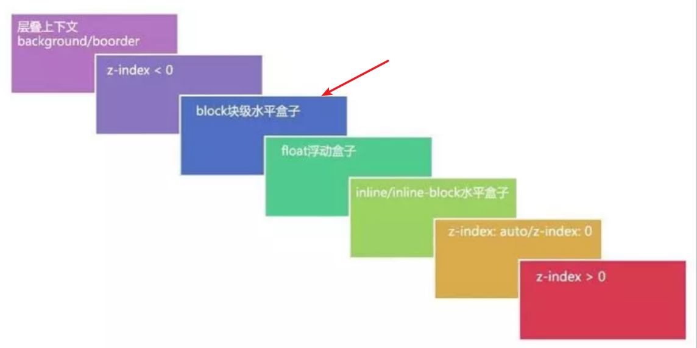

# HTML&CSS
## HTML

## 头部标签

| 标 签      | 描 述                                                                        |
| ---------- | :--------------------------------------------------------------------------- |
| `<title>`  | 定义页面标题内容。                                                           |
| `<meta>`   | 有关文档本身的元信息，例如：文档的作者，用于查询的关键词，关于文档的描述等。 |
| `<style>`  | 定义 CSS 层叠样式表的内容。                                                  |
| `<link>`   | 定义外部文件的链接，最常见的用途是链接外部样式表。                           |
| `<script>` | 定义页面中程序脚本的内容。                                                   |

```html
<!DOCTYPE html>
<html lang="en">
  <head>
    <meta charset="UTF-8" />
    <meta http-equiv="X-UA-Compatible" content="IE=edge" />
    <meta name="viewport" content="width=device-width, initial-scale=1.0" />
    <link href="main.css" rel="stylesheet" />
    <link rel="icon" href="favicon.ico" />
    <title>Document</title>
    <style></style>
  </head>
  <body>
    <button>123</button>
    <script></script>
  </body>
</html>
```

### 常见的`meta`标签及其作用(待补充)

```html
<meta name="viewport" content="width=device-width, initial-scale=1.0" />

<meta charset="utf-8" /> 使用 charset
属性来规定字符编码，在解析文档时，会告诉浏览器我们使用的编码形式。
```

:::tip

行内级元素与块级元素的区别

行内级元素(a,span,img)

​		&nbsp;&nbsp;&nbsp;&nbsp;&nbsp;&nbsp;&nbsp;1. 一般情况下只能包含行内级元素

​		&nbsp;&nbsp;&nbsp;&nbsp;&nbsp;&nbsp;&nbsp;2. 特点：不可以设置宽度和高度，宽度和高度由内容决定，与其他行内级元素在一行

块级元素(div,h1,p,ul,ol)

​		&nbsp;&nbsp;&nbsp;&nbsp;&nbsp;&nbsp;&nbsp;1. 一般情况下，可以包含其他任何元素（特例：p元素不能包含其他块级元素）

​		&nbsp;&nbsp;&nbsp;&nbsp;&nbsp;&nbsp;&nbsp;2. 独占一行，可以设置宽度和高度（设置完成之后依旧独占一行），高度由默认内容决定。

:::

## 行内标签

### \<a>\</a>

```html
<a target="_blank|_self" href="https://www.baidu.com"></a>
target=_blank 在新窗口中打开被链接文档。 target=_self
在相同的框架中打开被链接文档。 href属性为本文引用地址 利用a标签进行锚点链接
<p id="one">...</p>
<a href="#one">段落一</a>

a标签中放一个图片元素，点击图片既可以跳转
<a href="***"></a>
```

### \<span>\</span>

```html
一般用来存放文本
```

### \

```html

```

## 块级元素

### \<div\</div>

```html
主要作为容器盒子来进行布局。
```

### \<h1>\</h1>

```html
作为标题
```

### \<p>\</p>

```html
作为段落
```

### \<ol>\</ol>

```html
有序列表
<ol>
  <li>第一项</li>
  <li>第二项</li>
  <li>第三项</li>
</ol>
```

### \<ul>\</ul>

```html
无序列表 使用 type 属性可以修改列表开头的符号
<ul type="desc | circle | square">
  <li>第一项</li>
  <li>第二项</li>
  <li>第三项</li>
</ul>
```

## form 标签

```html
<form action="表单提交地址" method="提交方法"></form>

表单元素 
input元素 
	type属性 
		text 文本输入框（明文输入） 
		password 文本输入框（密文输入） 
		radio 单选框 name值一致的radio才具备单选功能 
		checkbox 复选框 同一类型的checkbox，name值要保持一致 		  button 按钮 
		reset 重置 
		submit 提交表单数据到服务器 
		file 文件上传 
	readnoly 属性 只读，布尔值 
	disabled 属性禁用，布尔值 checked属性 默认选用，只有当type属性为radios和checkbox才有用
	autofocus属性 页面加载时，自动聚焦，布尔值
	name属性，在提交数据给服务器时，可用于区分数据类型 
	value属性 
	
textarea元素
	cols属性 文本域的列数 
	rows属性 文本域的行数 
	
select元素（与option一起使用）
	multiple：可以多选 
	size：显示多少项 
	
option元素 
	selected 默认被选中 
	
button元素
	type属性 
		button 使用value属性设置按钮文字 
		reset重置它所属form的所有表单元素（包括input、textarea、select） 
		submit提交它所属form的表单数据给服务器（包括input、textarea、select） 

label元素
一般跟input配合使用，用来表示input的标题 for属性 属性值为input元素的id值。
<label for="peas">Do you like peas?</label>
<input type="checkbox" name="peas" id="peas" />
```

## 语义化元素

- header：头部元素
- nav：导航元素
- section：文档某个区域的元素
- article：内容元素
- aside：侧边栏元素
- footer：尾部元素



## CSS

## 选择器

```html
权重优先级 !important: 10000 
内联样式：1000 
id选择器：100
类选择器，伪类选择器，属性选择器：10 
元素选择器，伪元素选择器：1 
通配符：0
```

## 背景样式

<table>
    <tr>
    	<td>属性</td>
    	<td>取值</td>
    	<td>描述</td>
    </tr>
    <tr>
    	<td>background-color</td>
    	<td>颜色</td>
    	<td></td>
    </tr>
    <tr>
    	<td>background-image</td>
    	<td>url("***.jpg")</td>
    	<td></td>
    </tr>
    <tr>
    	<td>background-size</td>
    	<td>length | percentage | auto | cover | cover</td>
    	<td>第一个值设置宽度，第二个值设置高度。如果只给出一个值，第二个是设置为 auto（自动）。</td>
    </tr>
     <tr>
    	<td>background-position</td>
    	<td>一般为center</td>
    	<td>背景图片的位置</td>
    </tr>
    <tr>
    	<td>background-repeat</td>
    	<td>一般为no-repeat</td>
    	<td></td>
    </tr>
    <tr>
    	<td>background</td>
    	<td> (background-color) background-image position/background-size background-repeat</td>
    	<td>简写：background: url('') center/cover no-repeat ; 背景图片居中，不重复，大小为cover</td>
    </tr>
</table>

## 文本属性

<table>
    <tr>
    	<td>属性</td>
    	<td>可取值</td>
    	<td>描述</td>
    </tr>
    <tr style="color:red">
    	<td>line-height</td>
    	<td>normal、number、length、%</td>
    	<td>设置行高</td>
    </tr>
     <tr>
    	<td>text-indent</td>
    	<td>length、%</td>
    	<td>设置文本缩进</td>
    </tr>
     <tr style="color:red">
    	<td>text-align</td>
    	<td>left、right、center、justify、start、end</td>
    	<td>设置行内内容相对于块级父元素的对齐方式</td>
    </tr>
    <tr>
    	<td>letter-spacing</td>
    	<td>normal、length</td>
    	<td>设置字符（字母）间距</td>
    </tr>
     <tr>
    	<td>word-spacing</td>
    	<td>normal、length</td>
    	<td>设置单词之间的间距</td>
    </tr>
    <tr style="color:red">
    	<td>text-decoration</td>
    	<td>line、color、style、thickness</td>
    	<td>设置文本修饰
        	text-decoration:  underline red dashed 5px; 
        </td>
    </tr>
    <tr>
    	<td>white-space</td>
    	<td>normal、pre、nowrap、pre-wrap、pre-line、break-spaces</td>
    	<td>指定元素内的空白怎样处理，nowrap用的最多，表示不换行</td>
    </tr>
    <tr>
    	<td>line-break</td>
    	<td>auto、loose、normal、strict、anywhere、unset</td>
    	<td>处理如何断开带有标点符号的文本的行</td>
    </tr>
    <tr>
    	<td>text-transform</td>
    	<td>capitalize，uppercase，lowercase，none</td>
    	<td>设置文字的大小写转换</td>
    </tr>
</table>


## 字体属性

| 属性        | 可取值                                                       | 描述                           |
| ----------- | ------------------------------------------------------------ | ------------------------------ |
| font        | font-style、font-variant、font-weight、font-size（或 line-height）、font-family | 在一个声明中设置所有的字体属性 |
| font-family | 字体名称、inherit                                            | 设置字体类型                   |
| font-size   | length                                                       | 设置字体大小                   |
| font-weight | normal（默认）、bold、bolder、lighter、inherit 100、200…900（400=normal，700=bold） | 设置字体粗细                   |
| font-style  | normal、italic、oblique、inherit                             | 设置字体风格                   |

一般来说，和font相关，text相关，word相关的属性，都是可以继承的，而且继承的值都是计算值。

## 链接中的伪类

| 状态      | 效果                               |
| --------- | ---------------------------------- |
| a:link    | 普通的、未被访问的链接。  `未访问` |
| a:hover   | 鼠标指针位于链接的上方。 `悬浮`    |
| a:active  | 链接被单击的时刻。  `正点击`       |
| a:visited | 用户已访问的链接。  `已访问`       |

## 列表样式

| 属性                | 可取值                                                 | 描述                           |
| ------------------- | ------------------------------------------------------ | ------------------------------ |
| list-style          | list-style-type、list-style-position、list-style-image | 在一个声明中设置所有的列表属性 |
| list-style-image    | URL、none                                              | 设置图像为列表项标志           |
| list-style-position | inside、outside、inherit                               | 设置列表中列表项标志的位置     |
| list-style-type     | disc（默认）、circle、square、decimal 等               | 设置列表项标志的类型           |

## 盒子模型



| 区域          | 功能                                                         |
| ------------- | ------------------------------------------------------------ |
| 内容区content | 内容区在模型的中心包含了盒子内的信息也就是 HTML 元素。这些元素可以是文本、图片等 |
| 内边距padding | 内边距是内容区和边框之间的空间，可以被看作是`内容区的背景区域`。 |
| 边框border    | 边框用于标识`盒子的边界`，介于内边距和外边距之间。           |
| 外边距margin  | 外边距位于边框外部，是边框与周围之间的空间。                 |

```html
border: border-width border-style border-color;
border: 1px solid black;

padding: 上右下左;
padding: 10px;

margin: 上边距 右边距 下边距 左边距;
margin: 10px;
```

## display属性

| 属性    | 属性值       | 说明                     |
| ------- | ------------ | ------------------------ |
| display | block        | 元素以块级方式展示。     |
|         | inline       | 元素以内联方式展示。     |
|         | inline-block | 元素以内联块的方式展示。 |
|         | none         | 隐藏元素。               |

## 浮动

```html
float: left|right;
```

## 定位

| 属性     | 属性值   | 说明                                         |
| -------- | -------- | -------------------------------------------- |
| position | inherit  | 默认值                                       |
|          | relative | 该元素的位置相对于它原始的位置来计算的       |
|          | absolute | 以最近的祖先定位元素作为参考                 |
|          | fixed    | 被固定的元素不会随着滚动条的拖动而改变位置。 |

`z-index` 属性设定了一个`定位元素`及其后代元素或 flex 项目的 z-order。当元素之间重叠的时候，z-index 较大的元素会覆盖较小的元素在上层进行显示。

## CSS3 选择器

| 选择器                | 说明                                                         |
| :-------------------- | ------------------------------------------------------------ |
| 属性选择器            |                                                              |
| E[attr^=“xx”]         | 选择元素 E，其中 E 元素的 attr 属性是以 xx `开头`的任何字符。 |
| E[attr$=“xx”]         | 选择元素 E，其中 E 元素的 attr 属性是以 xx `结尾`的任何字符。 |
| E[attr*=“xx”]         | 选择元素 E，其中 E 元素的 attr 属性是`包含` xx 的任何字符。  |
| 子元素伪类选择器      |                                                              |
| E:first-child         | 选择元素 E 的第一个子元素。                                  |
| E:last-child          | 选择元素 E 的最后一个子元素。                                |
| E:nth-child(n)        | 选择元素 E 的第 n 个子元素，n 有三种取值，数字、odd 和 even。注意第一个子元素的下标是 1。 |
| E:only-child          | 选择元素 E 下唯一的子元素。                                  |
| E:first-of-type       | 选择父元素下第一个 E 类型的子元素。                          |
| E:last-of-type        | 选择父元素下最后一个 E 类型的子元素。                        |
| E:nth-of-type(n)      | 选择父元素下第 n 个 E 类型的子元素，n 有三种取值，数字、odd 和 even。 |
| E:only-of-type        | 选择父元素唯一的 E 类型的子元素。                            |
| E:only-of-type        | 选择父元素唯一的 E 类型的子元素。                            |
| E:nth-last-of-type(n) | 选择所有 E 元素倒数的第 n 个为 E 的子元素。                  |
| 伪类选择器            |                                                              |
| :focus                | 给获取焦点的元素设置样式。                                   |
| ::selection           | 给页面中被选中的文本内容设置样式。                           |
| :checked              | 给被选中的单选框或者复选框设置样式。                         |
| :enabled              | 给可用的表单设置样式。                                       |
| :disabled             | 给不可用的表单设置样式。                                     |
| :read-only            | 给只读表单设置样式。                                         |
| :read-only            | 给只读表单设置样式。                                         |
| :read-write           | 给可读写的表单元素设置样式。                                 |
| :valid                | 验证有效。                                                   |
| :invalid              | 验证无效。                                                   |

## 文本阴影
```html
text-shadow: x-offset y-offset blur color;
x-offset 是沿 x 轴方向的偏移距离，允许负值，必须参数。
y-offset 是沿 y 轴方向的偏移距离，允许负值，必须参数。
blur 是阴影的模糊程度，可选参数。
color 是阴影的颜色，可选参数。
text-shadow: 4px 4px 3px rgb(0, 255, 179);
```

## 文本溢出

| 属性          | 属性值   | 描述                             |
| ------------- | -------- | -------------------------------- |
| text-overflow | clip     | 修剪文本                         |
|               | ellipsis | 显示省略符号来代表被修剪的文本。 |

## 圆角边框

```html
border-radius: 左上角，右上角，右下角，左下角;
border-radius: 140px 20px 30px 40px; /*四个圆角直径不同*/
```

## 盒子阴影

```html
box-shadow: h-shadow v-shadow blur spread color inset;
h-shadow	必选，水平阴影的位置，允许负值。
v-shadow	必选，垂直阴影的位置，允许负值。
blur	可选，模糊距离。
spread	可选，阴影的大小。
color	可选，阴影的颜色。
inset	可选，将外部阴影改为内部阴影。
box-shadow: 10px 10px 5px #26ad8c;
```

## 渐变属性

```html
background-image: linear-gradient(side-or-corner|angle, linear-color-stop);
side-or-corner 是描述渐变线的起始位置，它包含两个关键词：第一个指出水平位置 left or right，第二个指出垂直位置 top or bottom。
angle 是用角度值来指定渐变的方向。
linear-color-stop 是设置渐变的颜色值。

/*从上到下线性渐变*/
background-image: linear-gradient(#ff577f, #c6c9ff);
/*从左上角到右下角的渐变*/
background-image: linear-gradient(to bottom right, #8ad7c1, #c6c9ff);
/*定义角度的渐变*/
background-image: linear-gradient(50deg, #bc6ff1, #ffd5cd);

background-image: radial-gradient(shape, color-stop);
shape 设置渐变的形状，其取值有 circle（圆形） 和 ellipse（椭圆）。
color-stop 设置某个确定位置的颜色值。
/*均匀分布径向渐变*/
background-image: radial-gradient(#ff577f, #c6c9ff, #8ad7c1);
/*椭圆形渐变*/
background-image: radial-gradient(ellipse, #8ad7c1, #c6c9ff, #fce2ce);
```

## 元素转换

| 属性      | 属性值         | 说明                      |
| --------- | -------------- | ------------------------- |
| transform | rotate(角度)   | 旋转，旋转中心在X,Y轴中心 |
|           | translate(X,Y) | 移动                      |
|           | scale(缩放值)  | 缩放                      |

## 过渡属性

```html
transition: 指定属性 持续时间 速度曲线 开始时间;
transition: transform 1s ease-in-out;
```

## 动画 

```html
@keyframes 动画名
{
    0% {样式属性：属性值;}
    25% {样式属性：属性值;}
    50% {样式属性：属性值;}
    100% {样式属性：属性值;}
}
这里的百分比是用来规定动画发生变化的时间的，0% 代表动画的开始，100% 代表动画的结束，中间的可以自定义。
将 @keyframes 创建的动画绑定到选择器上，通过 animation 属性就能实现动画效果了，其语法格式为：

animation: 动画名 动画持续时间 动画时间函数 动画延时 动画执行次数 动画方向(normal,reverse) 模式(none,forwards,backwards,both) 动画状态。
@keyframes move{
				from{margin-left: 0px;}
				to{margin-left: 500px;}
			}
animation: move 2s linear 0s infinite alternate both;
```

| 属性                      | 属性值                                              | 描述                                                         |
| ------------------------- | --------------------------------------------------- | ------------------------------------------------------------ |
| animation-name            |                                                     | 规定 @keyframes 动画的名称。                                 |
| animation-duration        |                                                     | 规定动画完成一个周期所花费的秒或毫秒。默认是 0。             |
| animation-timing-function |                                                     | 规定动画的速度曲线。默认是 "ease"。                          |
| animation-delay           |                                                     | 规定动画何时开始。默认是 0。                                 |
| animation-iteration-count |                                                     | 规定动画被播放的次数。默认是 1。                             |
| animation-direction       | normal \| reverse \| alternate \| alternate-reverse | normal：前到后，reverse：后到前，alternate：前到后，后到前alternate-reverse：后到前，前到后 |
| animation-fill-mode       | none\|forwards\|backwards\|both                     | 规定当动画不播放时（当动画完成时，或当动画有一个延迟未开始播放时），要应用到元素的样式。 |

## 弹性盒子

```html
flex-direction: row(默认) | row-reverse | column | column-reverse;

justify-content: flex-start(默认) | flex-end | center | space-between | space-around | space-evenly

align-items: flex-start | flex-end | center | baseline | stretch(默认);

flex-wrap: nowrap(默认)|wrap|wrap-reverse|initial|inherit;

align-content: stretch(默认) | flex-start | flex-end | center | space-between | space-around ;
可以用于控制多行的对齐方式，如果只有一行则不会起作用,一般与flex-wrap连用处理多行对齐。
```

## 弹性元素

```html
align-self: auto|stretch|center|flex-start|flex-end|baseline|initial|inherit;默认值为auto。
元素继承了它的父容器的 align-items 属性。如果没有父容器则为 "stretch"。
flex-grow	默认为0
flex-shrink	默认为1
flex-basis	默认为auto，决定弹性元素宽度的属性优先级从高到低排列：
    a：max-width\max-height\min-width\min-height 
    b：flex-basis  
    c：width\height  
    d：内容本身的大小
flex  是flex-grow || flex-shrink || flex-basis 的简写  
  a. 单值
    ⅰ. 一个数字：flex:1    它被当做 flex-grow 的值
    ⅱ. 一个宽度：flex:200px    它会被当作 flex-basis 的值 
    ⅲ. 关键字 none ，auto，initial
  b. 双值：第一个值被当做 flex-grow的值
    ⅰ. 第二个值为数字，它被当做 flex-shrink 的值  flex:1 1 ===》   flex-grow:1;  flex-shrink:1;
    ⅱ. 第二个值为宽度：flex:1 200px    ===》   flex-grow:1;  flex-basis:200px;
  c. 三值
    ⅰ. flex:1 1 200px;    flex-grow:1;  flex-shrink:1 ; flex-basis:200px;
```

## 标准文档流

+ 从左到右、从上到下按顺序摆放好  
+  默认情况下，互相之间不存在层叠现象  
+ 块级元素默认占一行
+ 行内级元素相互紧贴



**设置position:absulote;和position:fixed元素会脱离标准文档流**

- **不再严格按照从上到下、从左到右排布 （不受标准流的约束）**
- **不再严格区分块级、行内级，块级、行内级的很多特性都会消失**  
-  **可以随意设置宽高  （内减模式）**
-  **宽高默认由内容决定**
-  **不再给父元素汇报宽高数据**   
-  **脱标元素内部默认还是按照标准流布局**  

**设置浮动元素也会脱离标准文档流**

**float 属性最初只用于在一段文本内浮动图像, 实现文字环绕的效果**   

**浮动规则**

1. **浮动元素的边界一定是挨着包含块的边界或者其它浮动元素的边界，定位元素会层叠在浮动元素上面**
2. **浮动元素的边界不能超过包含块的边界(content)**
3. **浮动元素之间不能层叠**
4. **浮动元素会将行内级元素（inline-block，行内元素，文字部分）推出（挤出去）**
5. **行内级元素、inline-block元素浮动后，其顶部将与所在行的顶部对齐**

**清除浮动**

**.clear-fix::after{display:block;content:"";clear:both;}**
** 折叠上下文 **
层叠上下文，又称stacking context，是指元素在垂直于屏幕的z轴上的排列布局。
其中影响层叠上下文的属性包括以下几种：

1.  flex元素的子元素，同时z-index不是auto 
2.  opacity值不为1的元素 
3.  transform值不为none的元素 
4.  position值为relative/absolute/fixed的元素 


通过上图可知，绝对定位元素（z-index大于等于0）的话，是在浮动元素上面。

## 元素隐藏的方法

1. display:none	脱离正常文档流了（但是还在DOM树内）
2. visibility:none 不可见  ，点击事件无效
3. opacity:0	透明度设置为0，点击事件有效

## CSS中的函数

- var：定义CSS中的变量
- - 定义变量名：   :root{ --my-color:red; }   
  - 使用变量名:      div{ color:var(--my-color) }
- calc：计算CSS值，通常用来计算元素的大小或者位置
- - 例如：width: calc(100% - 60px)   - 旁边得有空格
- blur：毛玻璃效果
- - blur(radius)
  -  通常会和两个属性一起使用：
- - - filter: 将模糊或颜色偏移等图形效果应用于元素; 
    - backdrop-filter: 为元素后面的区域添加模糊或者其他效果  
- gradient：颜色渐变函数

## CSS中的相对单位

+ em:  在`font-size`中是相对父元素的字体大小，其他属性是相对自身元素的字体大小。
+ rem:  相对根元素的字体大小
+ vw/vh:  视口宽度/高度的1%

## 浏览器前缀

-  -o-、-xv-：Opera等 
- -ms-、mso-：IE等 
- -moz-：Firefox等 
- -webkit-：Safari、Chrome等  
- 可以用打包工具解决这个问题

## 个人写CSS的习惯

1. 先布局（大多数为flex，还有position，float）
2. 盒子模型（padding，margin，border-radius，height，width）
3. 字体/文本相关（font-size，font-weight，text-decoration，line-height，white-space）
4. 颜色相关（color，background）
5. 变化（transition，transform）