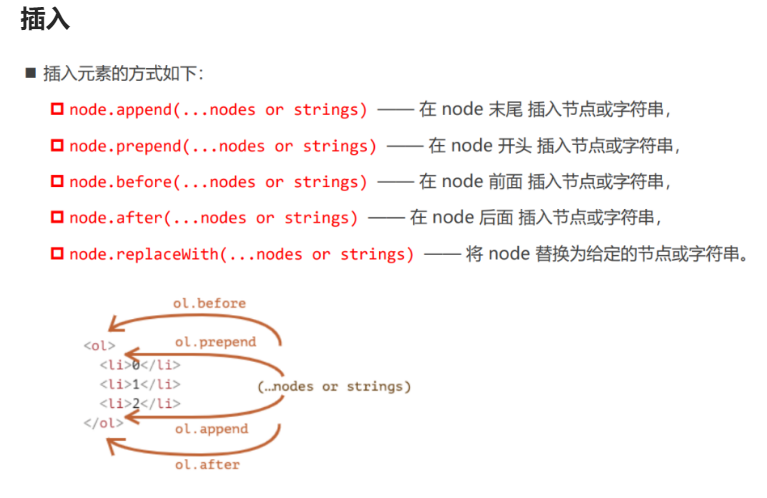

# jQuery

## 基础用法

```JS
1 引入jQuery
2 页面加载完成再获取DOM元素 

<script src="js/jquery-1.12.4.min.js"></script>
<script>
    window.onload = function(){
        var oDiv = document.getElementById('div01');
        alert('原生就是获取的div：' + oDiv);
    };
    /*
    $(document).ready(function(){
        var $div = $('#div01');
        alert('jquery获取的div：' + $div);
    });
    */
    // 上面ready的写法可以简写成下面的形式：
    $(function(){
        var $div = $('#div01');
        alert('jquery获取的div：' + $div);
    }); 
</script>

<div id="div01">这是一个div</div>
```

## 选择器

```js
标签选择器
类选择器
id选择器
层级选择器
属性选择器

选择器的优先级：
important
内联样式
id选择器
类选择器，伪类选择器，属性选择器
元素选择器，伪元素

实例代码
$('#myId') //选择id为myId的标签
$('.myClass') // 选择class为myClass的标签
$('li') //选择所有的li标签
$('#ul1 li span') //选择id为ul1标签下的所有li标签下的span标签
$('input[name=first]') // 选择name属性等于first的input标签

增强
$('.myClass:even') 	index为偶数的元素
$('.myClass:odd') 	index为奇数的元素
```

## 筛选器

在选择标签的集合里面筛选自己需要的标签

```js
has(选择器名称)方法，表示选取包含指定选择器的标签
eq(索引)方法，表示选取指定索引的标签(下标从0开始)
first()方法，列表第一个元素
last()方法，列表最后一个元素
$().hasClass("类名");	判断指定元素是否包含该类名的元素。
$().is(selector);	判断指定元素中是否有符合条件的存在。
$().not(selector|function)	选择不符合条件的元素

var $div = $("div").has("#app");  
var $div = $("div").eq(1);  
```

## DOM查找

以选择的标签为参照，然后获取转移后的标签

```js
原生js之间的导航
● 前兄弟元素：previousElementSibling 
● 后兄弟元素：nextElementSibling 
● 父元素：parentElement 
● 子元素：children 
● 第一个子元素：firstElementChild 
● 最后一个子元素：lastElementChild

$('#box').prev(); 表示选择id是box元素的上一个的同级元素
$('#box').prevAll(); 表示选择id是box元素的上面所有的同级元素
$('#box').next(); 表示选择id是box元素的下一个的同级元素
$('#box').nextAll(); 表示选择id是box元素的下面所有的同级元素
$('#box').parent(); 表示选择id是box元素的父元素
$('#box').children(); 表示选择id是box元素的所有子元素
$('#box').siblings(); 表示选择id是box元素的其它同级元素
$('#box').find(selector);  find 方法可以查找到指定元素的所有后代元素。
$('#box').find('.myClass'); 表示选择id是box元素的class等于myClass的元素

<ul id="list">
    <li>1</li>
    <li>2</li>
    <li>3</li>
    <li>4</li>
    <li>5</li>
</ul>
$list = $("#list li");
console.log($list.first().next().text());   输出2 
console.log($list[0]);		jQuery对象 转换成  DOM元素 > jquery对象[0]
console.log($($list[0]));	DOM元素 转成 jQuery 对象   > $(DOM对象)
```

## 元素内容

```js
原生js：innerHTML属性
document.querySelector("div").innerHTML = "hhh"
jQuery：html()方法可以获取和设置标签的html内容
$(function(){
        var $div = $("#div1");
        //  获取标签的html内容
        var result = $div.html();
        alert(result);
        //  设置标签的html内容，之前的内容会清除
        $div.html("<span style='color:red'>你好</span>");
        //  追加html内容
        $div.append("<span style='color:red'>你好</span>");
    });

原生js：textContent属性
text() 获取匹配元素包含的文本内容
语法：$('#box').text();
设置该所有的文本内容
$('#box').text('<a href="https://www.baidu.com">百度一下</a>');
注意：值为标签的时候 不会被渲染为标签元素 只会被当做值渲染到浏览器中
<a href="https://www.baidu.com">百度一下</a>  只会渲染成这样
```

## 元素属性

```js
操作css原生js的写法：	 
ele.style.cssText = `width:100px; height:100px;`
jQuery：css()方法可以给标签设置样式属性		
$div.css({"color":"red", fontSize: "36px"})
$list.css("color", "red");

操作类的原生js写法：
ele.className.add()
ele.className.remove()
ele.className.toggle()
ele.className.contain()

jQuery写法
addClass（添加多个类名）
为每个匹配的元素添加指定的类名。
$('div').addClass("box box2");//追加多个类名
removeClass
$('div').removeClass('box')；
移除全部的类
$('div').removeClass();
toggleClass
如果存在（不存在）就删除（添加）一个类。
$('span').click(function(){
    //动态的切换class类名为active
    $(this).toggleClass('active')
})

原生js获取元素的attribute：ele.name = "xxx"  ele.id = "***"
attr()	设置属性值或者 返回被选元素的属性值
//获取值：attr()设置一个属性值的时候 只是获取值
var id = $('div').attr('id')
//设置一个值 设置div的class为box
$('div').attr('class','box')

removeAttr()  移出属性
//删除单个属性
$('#box').removeAttr('name');
//删除多个属性
$('#box').removeAttr('name class');

jQuery：prop()方法可以设置标签的其它属性 $div.prop({"href":"http://www.baidu.com","title":'baidu',"class":"a01"})
prop()用法和attr的用法基本一致，只不过prop用来获取radio，checkbox，select这种返回值为true，false属性值的操作
$('input[type="checkbox"]').first().prop('checked')   // false
$('input[type="checkbox"]').first().attr('checked')	  // undefined
removeProp()  移出属性

原生js：ele.value
jQuery：val()方法可以获取value属性和设置value属性
val()用于表单控件中获取值，比如input textarea select等等
设置值的话：$('input').val('设置了表单控件中的值')；

```

## DOM元素的增删改查



```js
原生js
createElement("div")
node.append()
node.prepend()
node.before()
node.after()
node.replaceWith(newNode)	用newNode替换node
node.remove()
node.clone()	是否深度克隆

jQuery方法
元素.append(子元素)  插入末尾 (内部插入)  
元素.prepend(子元素) 插入开头 (内部插入)
元素.after()  插入末尾 (外部插入)  
元素.before() 插入开头 (外部插入)
元素.replaceWith(newNode)	用newNode替换node
元素.remove()		删除了整个标签（自身和子节点都没有了）
元素.empty();      清空选中元素中的所有后代节点(保留自身，删除子节点)
元素.clone()		克隆元素
$("b").clone().prependTo("p");
```


## 事件

```js
click() 鼠标单击
blur() 元素失去焦点
focus() 元素获得焦点
mouseover() 鼠标进入（进入子元素也触发）
mouseout() 鼠标离开（离开子元素也触发）
ready() DOM加载完成

this指的是当前发生事件的对象，但是它是一个原生js对象
$(this) 指的是当前发生事件的jquery对象

原生js：
ele.onclick = function(){console.log(123)}
jQuery
$div.click = function(){}

<script>
    $(function(){
        var $li = $('.list li');
        var $button = $('#button1')
        var $text = $("#text1");
        var $div = $("#div1")

        //  鼠标点击
        $li.click(function(){             
            // this指的是当前发生事件的对象，但是它是一个原生js对象
            // this.style.background = 'red';

            // $(this) 指的是当前发生事件的jquery对象
            $(this).css({'background':'gold'});
            // 获取jquery对象的索引值,通过index() 方法
            alert($(this).index());
        });

        //  一般和按钮配合使用
        $button.click(function(){
            alert($text.val());
        });

        //  获取焦点
        $text.focus(function(){
            $(this).css({'background':'red'});

        });

        //  失去焦点
        $text.blur(function(){
            $(this).css({'background':'white'});

        });

        //  鼠标进入
        $div.mouseover(function(){
            $(this).css({'background':'gold'});

        });

        //  鼠标离开
        $div.mouseout(function() {
            $(this).css({'background':'white'});
        });
    });
</script>

<div id="div1">
    <ul class="list">
        <li>列表文字</li>
        <li>列表文字</li>
        <li>列表文字</li>
    </ul>

    <input type="text" id="text1">
    <input type="button" id="button1" value="点击">
</div>
```

## 事件代理

```js
delegate(childSelector,event,function)
childSelector: 子元素的选择器
event: 事件名称，比如: 'click'
function: 当事件触发执行的函数

元素js
document.querySelector("ul").onclick = function (e) {
    if (e.target.tagName === "LI") {
        console.log(e.target.textContent); // e指的是这次事件
        console.log(this);   // this 指的是 ul元素
    }
};

<ul id="list">
    <li>1</li>
    <li>2</li>
    <li>3</li>
    <li>4</li>
    <li>5</li>
  </ul>
  <script>
    $(function () {
      $list = $("#list");
      // 父元素ul 来代理 子元素li的点击事件
      $list.delegate("li", "click", function () {
        // $(this)表示当前点击的子元素对象
        $(this).css({ background: "red" });
      });
    });
```

AJAX

jquery封装成了一个方法$.ajax()，我们可以直接用这个方法来执行ajax请求。

```js
<script>
    $.ajax({
    // 1.url 请求地址
    url:'http://t.weather.sojson.com/api/weather/city/101010100',
    // 2.type 请求方式，默认是'GET'，常用的还有'POST'
    type:'GET',
    // 3.dataType 设置返回的数据格式，常用的是'json'格式，还有xml，html，text格式
    dataType:'JSON',
    // 4.data 设置发送给服务器的数据, 没有参数不需要设置
​	data: {},
    // 5.success 设置请求成功后的回调函数
    success:function (response) {
        console.log(response);    
    },
    // 6.error 设置请求失败后的回调函数
    error:function () {
        alert("请求失败,请稍后再试!");
    },
    // 7.async 设置是否异步，默认值是'true'，表示异步，一般不用写
    async:true
});
</script>

简写
$.get和$.post方法的参数说明:
$.get(url,data,success(data, status, xhr),dataType).error(func)
$.post(url,data,success(data, status, xhr),dataType).error(func)
url 请求地址
data 设置发送给服务器的数据，没有参数不需要设置
    success 设置请求成功后的回调函数
    data 请求的结果数据
    status 请求的状态信息, 比如: "success"
    xhr 底层发送http请求XMLHttpRequest对象
dataType 设置返回的数据格式
    "xml"
    "html"
    "text"
    "json"
error 表示错误异常处理
func 错误异常回调函数

<script>
    $(function(){
        /*
         1. url 请求地址
         2. data 设置发送给服务器的数据, 没有参数不需要设置
         3. success 设置请求成功后的回调函数
         4. dataType 设置返回的数据格式，常用的是'json'格式, 默认智能判断数据格式
        */ 
        $.get("http://t.weather.sojson.com/api/weather/city/101010100", function(dat,status){
            console.log(dat);
            console.log(status);
            alert(dat);
        }).error(function(){
            alert("网络异常");
        });

        /*
         1. url 请求地址
         2. data 设置发送给服务器的数据, 没有参数不需要设置
         3. success 设置请求成功后的回调函数
         4. dataType 设置返回的数据格式，常用的是'json'格式, 默认智能判断数据格式
        */ 
        $.post("test.php", {"func": "getNameAndTime"}, function(data){
            alert(data.name); 
            console.log(data.time); 
        }, "json").error(function(){
            alert("网络异常");
        }); 
    });
</script>
```

